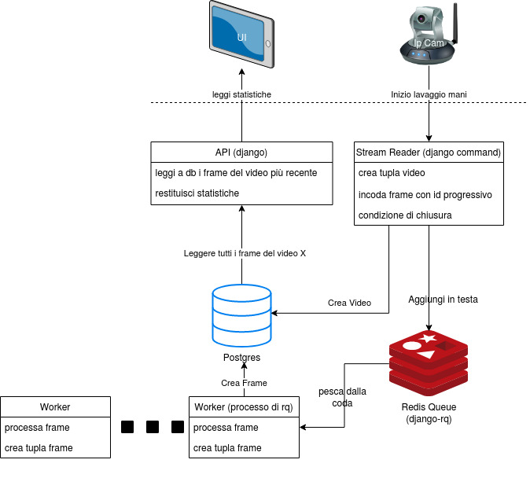

# Get started

## If you want to use virtual env
* create
```
python3.6 -m venv venv
```
* activate
```
source venv/bin/activate
```
* deactivate
```
deactivate
```

## Install requirements
```
# python 3
# postgres?
# redis
# sudo apt install redis-server
sudo apt install ffmpeg
# Libreria da installare per psyco-pg:
sudo apt-get install libpq-dev
pip install -r requirements
```

## Run Migration
Per creare il db se ancora non c'è oppure aggiornarlo se è cambiata la versione
```
cd django_wyh
python manage.py migrate
```

## Categories on database 
```
cd django_wyh
python manage.py import_categories
```

## Run server
```
cd django_wyh
python manage.py runserver
# run with postgres (default use sqlite, common for devs environment)
# DATABASE_URL='postgres://<user>:<password>@localhost:5432/<dbname>?sslmode=disable' python manage.py runserver
# env DATABASE_URL va settata anche per le migrate e qualsiasi comando manage.py o meglio va messa la variabile d'ambiente in produzione di modo che da qualsiasi shell sia visibile

#routes
firefox localost:8000/admin
```

## Run all environment for dev
```
cd django_wyh
honcho start
```

## Create superuser
```
cd django_wyh
python manage.py createsuperuser
```

## Run stream reader
```
cd django_wyh
python manage.py stream_reader3D --user <id-user> --video <video-path|ip-camera-url>
```

## Redis clear all data
* per pulire redis
```
redis-cli flushall
```

## Redis RQ

* run redis server
```
redis-server
```

* run worker
```
cd django_wyh
# run on CPU
CUDA_VISIBLE_DEVICES="" python manage.py rqworker default --worker-class rq.SimpleWorker
# run on GPU 0
CUDA_VISIBLE_DEVICES="0" python manage.py rqworker default --worker-class rq.SimpleWorker
```

* run django
```
# leggere sezione run server per eseguire il server
firefox http://localhost:8000/django-rq/
```

## Api example

* alive
```
curl -X POST http://localhost:8000/api/alive
# {"status":"ok"}
```

* api statistiche del video
```
curl -X POST -H "Content-Type: application/json" --data '{"video_id":5}' http://localhost:8000/api/stats
# {"other":5.0}
```

* api start stream reader
```
curl -X POST -H "Content-Type: application/json" --data '{"user_id":1,"camera_id":1}' http://localhost:8000/api/start_video
```

* api stop stream reader
```
curl -X POST -H "Content-Type: application/json" --data '{"video_id":1}' http://localhost:8000/api/stop_video
```

* api user list
```
curl http://localhost:8000/api/users
# [{"name":"user1","id":1}, {"name":"user2","id":2}]
```

* api camera list
```
curl http://localhost:8000/api/cameras
# [{"name":"camera1","id":1,"url":"http://localhost:1000"}, {"name":"camera2","id":2,"url":"/path/of/a/video.mp4"}]
```

* api videos list
```
curl http://localhost:8000/api/videos
# or filter by user id
curl http://localhost:8000/api/videos?user=1
```

* api download video 
```
curl http://localhost:8000/api/download_video?video_id=1
```

## Architecture




## Models
* I modelli sono stati caricati su [github](https://github.com/artelab/wash_your_hands_models/releases/)
* Nella cartella django_wyh/models copiare il modello con il TAG più aggiornato, rinominandolo come sotto
  *  wash_youy_hand/django_wyh/models/resnet50-3D-ep300_state_dict.pth

## Django show all urls
```
cd django_wyh
python manage.py show_urls
```

## RUN demo su risen
* attivare ngrock
```
cd Documents/ngrok/
nohup ./ngrock http 8000 &
```
* run server and workers
```
cd Projects/whash_your_hand
source venv/bin/activate
cd django_wyh
nohup python manage.py runserver &> server.out&
CUDA_VISIBLE_DEVICES="" nohup python manage.py rqworker default --worker-class rq.SimpleWorker &> worker.out&
```

